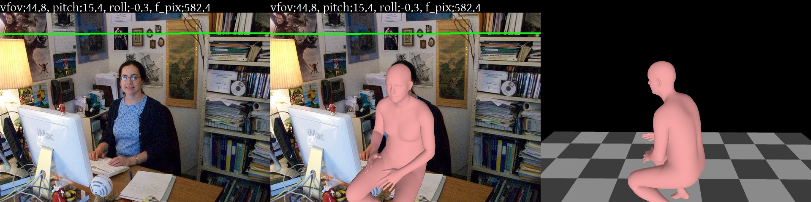

# SPEC: Seeing People in the Wild with an Estimated Camera [ICCV 2021]

[]()
[](https://spec.is.tue.mpg.de/)
[](https://arxiv.org/abs/2110.00620)

> [**SPEC: Seeing People in the Wild with an Estimated Camera**](https://arxiv.org/abs/2110.00620),            
> [Muhammed Kocabas](https://ps.is.tuebingen.mpg.de/person/mkocabas), 
> [Chun-Hao Paul Huang](https://ps.is.tuebingen.mpg.de/person/chuang2), 
> [Joachim Tesch](https://ps.is.tuebingen.mpg.de/person/jtesch), 
> [Lea Müller](https://ps.is.tuebingen.mpg.de/person/lmueller2), 
> [Otmar Hilliges](https://ait.ethz.ch/people/hilliges/),
[Michael J. Black](https://ps.is.tuebingen.mpg.de/person/black),        
> *International Conference on Computer Vision (ICCV), 2021* 

<p float="center">
  
</p>

## Features

SPEC is a camera-aware human body pose and shape estimation method. 
It both predicts the camera parameters and SMPL body model for a given image.
[CamCalib](camcalib) predicts the camera parameters. 
[SPEC](spec) uses these parameters to predict SMPL body model parameters.

This implementation:
- has the demo code for SPEC and CamCalib implemented in PyTorch.
- achieves SOTA results in SPEC-SYN and SPEC-MTP datasets.
- shows how to perform evaluation on SPEC-SYN and SPEC-MTP datasets.

## Updates

- 13/10/2021: Demo and evaluation code is released.

## Getting Started

SPEC has been implemented and tested on Ubuntu 18.04 with python >= 3.7.
If you don't have a suitable device, try running our Colab demo.

Clone the repo:

```shell
git clone https://github.com/mkocabas/SPEC.git
```

Install the requirements using virtualenv or conda:

```shell
# pip
source scripts/install_pip.sh

# conda
source scripts/install_conda.sh
```

## Running the Demo

### SPEC

First, you need to download the required data 
(i.e our trained model and SMPL model parameters). It is approximately 1GB. 
To do this you can just run:

```shell
source scripts/prepare_data.sh
```

Then, running the demo is as simple as:

```shell
python scripts/spec_demo.py \
  --image_folder data/sample_images \
  --output_folder logs/spec/sample_images
```
Sample demo output:

<p float="left">
  
</p>

Here the green line is the horizon obtained using estimated camera parameters.
On the right, the ground plane is visualized to show how accurate the global translation is.

### CamCalib

If you are only interested in estimating the camera parameters of an image, 
run the CamCalib demo:

```shell
python scripts/camcalib_demo.py \
  --img_folder <input image folder> \
  --out_folder <output folder> \
  --show # visualize the raw network predictions
```

This script outputs a pickle file which contains the predicted camera parameters for each input image along with an output
image which visualizes the camera parameters as a horizon line. Pickle file contains:
```
'vfov' : vertical field of view in radians
'f_pix': focal length in pixels
'pitch': pitch in radians
'roll' : roll in radians
```

## Google Colab

## Training

Training instructions will follow soon.

## Datasets

Pano360, SPEC-MTP, and SPEC-SYN are new datasets introduced in our paper.
You can download them from the [Downloads](https://spec.is.tue.mpg.de/download.php) 
section of our [project page](https://spec.is.tue.mpg.de).

For Pano360 dataset, we have released the Flickr image ids which can be used to download images
using FlickrAPI. 
We have provided a [download script](scripts/download_flickr.py) in this repo.
Some of the images will be missing due to users deleting their photos. 
In this case, you can also use `scrape_and_download` function provided 
in the script to find and download more photos.

After downloading the SPEC-SYN, SPEC-MTP, Pano360, and [3DPW](https://virtualhumans.mpi-inf.mpg.de/3DPW/) 
datasets, the `data` folder should look like:

```shell
data/
├── body_models
│   └── smpl
├── camcalib
│   └── checkpoints
├── dataset_extras
├── dataset_folders
│   ├── 3dpw
│   ├── pano360
│   ├── spec-mtp
│   └── spec-syn
├── sample_images
└── spec
    └── checkpoints
```

## Evaluation
You can evaluate SPEC on SPEC-SYN, SPEC-MTP, and 3DPW datasets by running:
```shell
python scripts/spec_eval.py \
  --cfg data/spec/checkpoints/spec_config.yaml \
  --opts DATASET.VAL_DS spec-syn_spec-mtp_3dpw-test-cam
```

Running this script should give results reported in this table:

| | W-MPJPE | PA-MPJPE | W-PVE|
|--- | --- | --- | ---|
|SPEC-MTP | 124.3 | 71.8 | 147.1|
|SPEC-SYN | 74.9 | 54.5 | 90.5|
|3DPW | 106.7 | 53.3 | 124.7|

## Citation

```bibtex
@inproceedings{SPEC:ICCV:2021,
  title = {{SPEC}: Seeing People in the Wild with an Estimated Camera},
  author = {Kocabas, Muhammed and Huang, Chun-Hao P. and Tesch, Joachim and M\"uller, Lea and Hilliges, Otmar and Black, Michael J.},
  booktitle = {Proc. International Conference on Computer Vision (ICCV)},
  pages = {11035--11045},
  month = oct,
  year = {2021},
  doi = {},
  month_numeric = {10}
}
```
## License

This code is available for **non-commercial scientific research purposes** as defined in the [LICENSE file](LICENSE). By downloading and using this code you agree to the terms in the [LICENSE](LICENSE). Third-party datasets and software are subject to their respective licenses.

## References

We indicate if a function or script is borrowed externally inside each file.
Here are some great resources we benefit:

- Pano360 dataset preprocessing is borrowed from [Single View Metrology in the Wild](https://github.com/Jerrypiglet/ScaleNet).
- Most of the utility functions depends on our another paper [PARE](github.com/mkocabas/PARE).
- Some functions are borrowed from [SPIN](https://github.com/nkolot/SPIN).

Consider citing these works if you use them in your project.


## Contact

For questions, please contact spec@tue.mpg.de

For commercial licensing (and all related questions for business applications), please contact ps-licensing@tue.mpg.de.